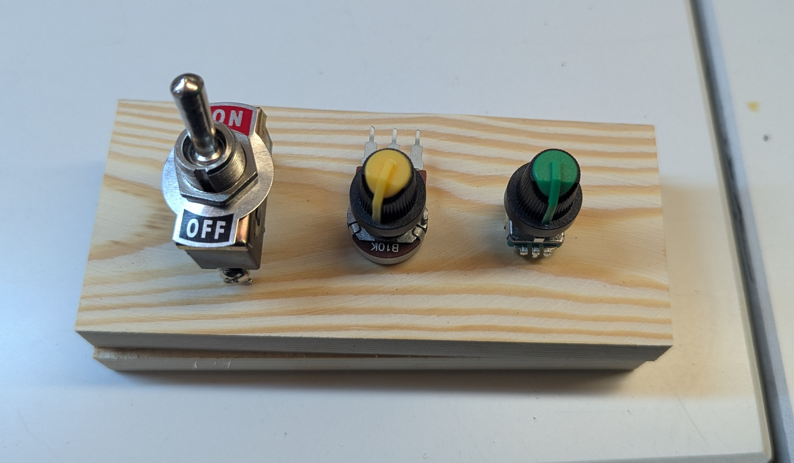
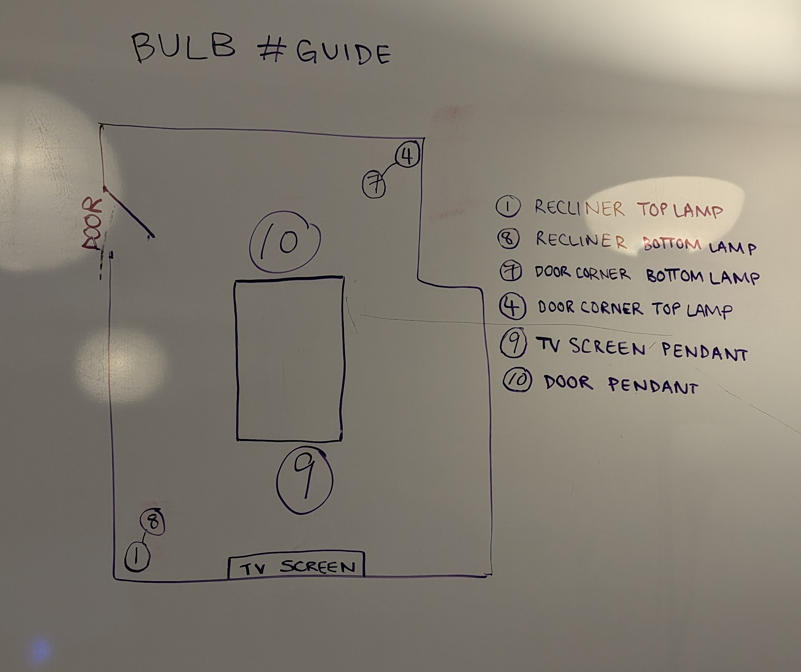
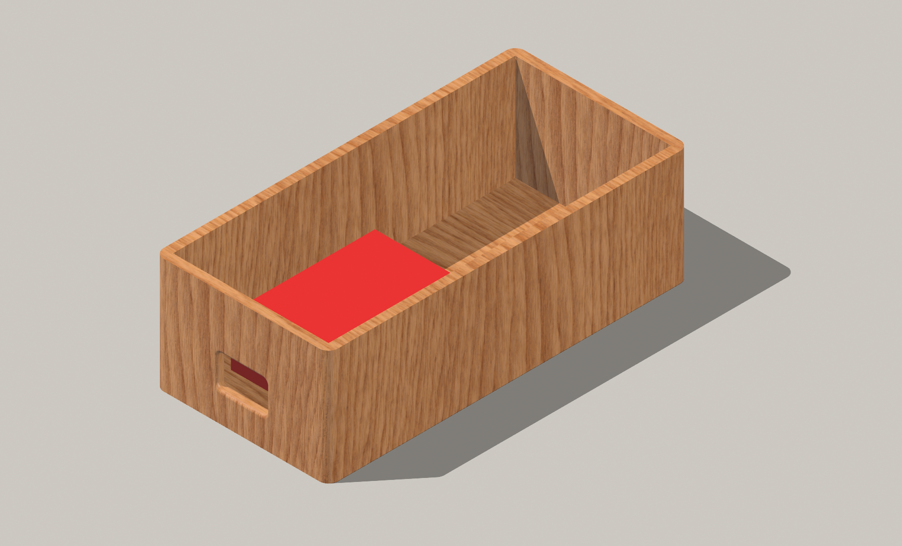
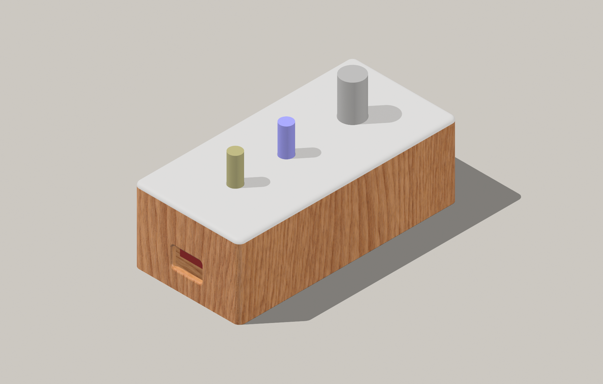

# Building a Physical Hue Light Controller

For my second Connected Devices project, I built a direct interface for controlling Philips Hue lights.



The project builds on Tom Igoe's [Hue API examples](https://tigoe.github.io/hue-control/) to create three basic controls: a switch for power, and two potentiometers for brightness and color temperature.

## Hardware Setup

The circuit uses standard components:
- Arduino Nano 33 IoT
- Toggle switch for power
- Two 10kΩ potentiometers for brightness and color temperature
- Basic breadboard and jumper wires



The wiring is minimal: toggle switch to pin 2 (using the internal pull-up), brightness pot to A0, and color temperature pot to A1.

## Software Implementation

The software part is where things get more interesting. At its core, we're just reading inputs and sending them to the Hue Bridge. Here's the core configuration:

```cpp
// Hue control settings
const int numLights = 2;  // Number of lights to control
const int lightNumbers[numLights] = {9, 10};  // The IDs of the lights to control

// Pin definitions
const int toggleSwitchPin = 2;    // Digital pin for the toggle switch
const int brightnessPotPin = A0;  // Analog pin for brightness potentiometer
const int colorTempPotPin = A1;   // Analog pin for color temperature potentiometer
```

Here's how we send commands to the Hue Bridge:

```cpp
bool sendHueCommand(int lightId, const String& command, const String& value) {
  String request = "/api/";
  request += SECRET_HUE_KEY;
  request += "/lights/";
  request += String(lightId);
  request += "/state";

  String contentType = "application/json";
  String hueCmd = "{\"" + command + "\":" + value + "}";
  
  httpClient.beginRequest();
  return httpClient.put(request, contentType, hueCmd);
}
```

To prevent flooding the Hue Bridge with requests from small potentiometer movements, I implemented a threshold system:

```cpp
if (isLightOn && abs(mappedBrightness - lastBrightnessValue) > updateThreshold) {
  currentBrightness = mappedBrightness;
  
  for (int i = 0; i < numLights; i++) {
    sendHueCommand(lightNumbers[i], "bri", String(currentBrightness));
  }
  
  lastBrightnessValue = currentBrightness;
  delay(debounceDelay);
}
```

## Working with the Hue API

The Hue API integration requires three key pieces:
1. Your Hue Bridge's IP address
2. An authorized API key (the "username" in Hue API terms)
3. The IDs of the lights you want to control

These are stored in a separate `arduino_secrets.h` file:

```cpp
#define SECRET_SSID "your-wifi-name"
#define SECRET_PASS "your-wifi-password"

// Philips Hue bridge credentials
#define SECRET_HUE_IP "192.168.1.100" // Your Hue bridge IP
#define SECRET_HUE_KEY "abcd1234" // Your Hue user key
```

## Results

The final implementation provides direct control over brightness and color temperature for a pair of Hue lights. The response is immediate and requires no screens or menus.

Each control maps to a specific function:
- Toggle switch: Power on/off
- Left pot: Brightness (0-100%)
- Right pot: Color temperature (6500K to 2000K)

## Enclosure Design

To make the controller more durable and portable, I designed a simple 3D-printed enclosure. The design keeps the controls accessible while protecting the circuit and providing a clean look.



The enclosure includes:
- Mounting points for the Arduino and breadboard
- Cutouts for the potentiometers and switch
- Cable routing for USB power
- Removable lid for easy access



The STL files are available in the project repository (see `documentation/hue-control-enclosure.3mf`).

## Next Steps

Some ideas for improvements:
1. A proper enclosure (3D printed)
2. Full RGB color control with a third pot
3. Preset configurations with momentary buttons
4. Battery power for portability

The code is available in the project repository, building on Tom Igoe's [hue-control](https://tigoe.github.io/hue-control/) examples.